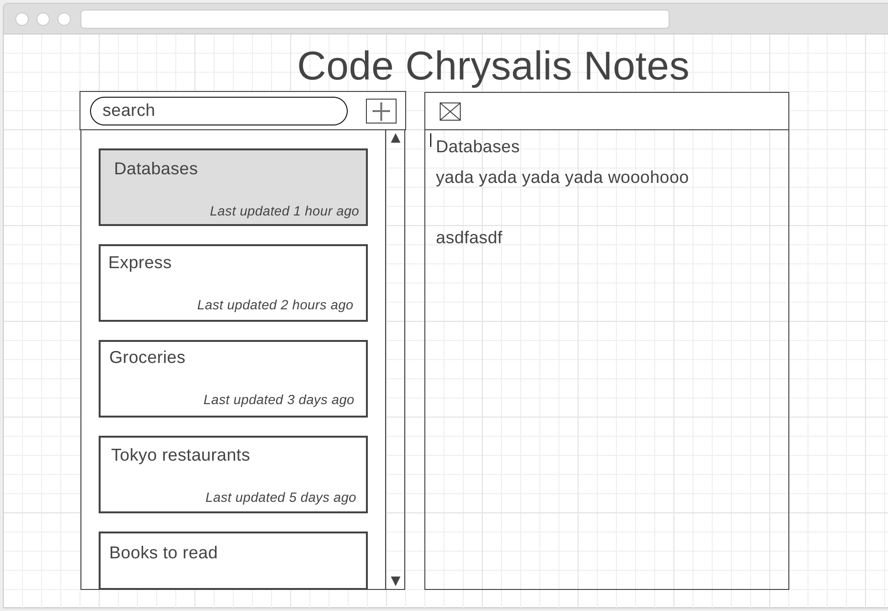
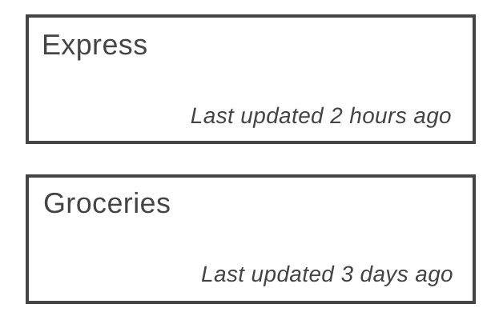
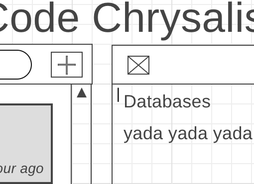
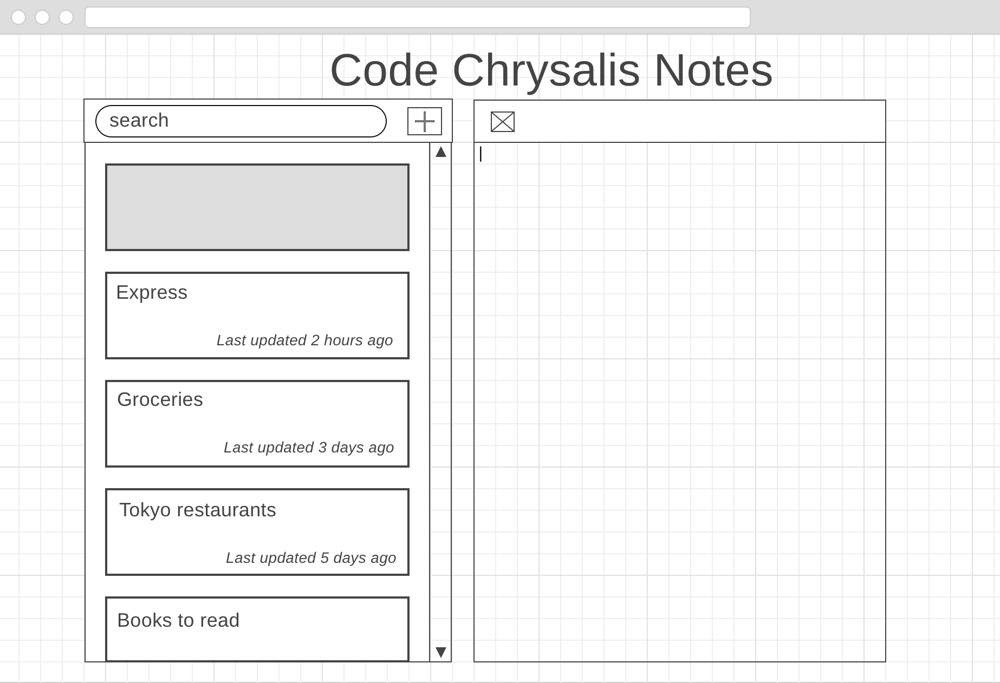
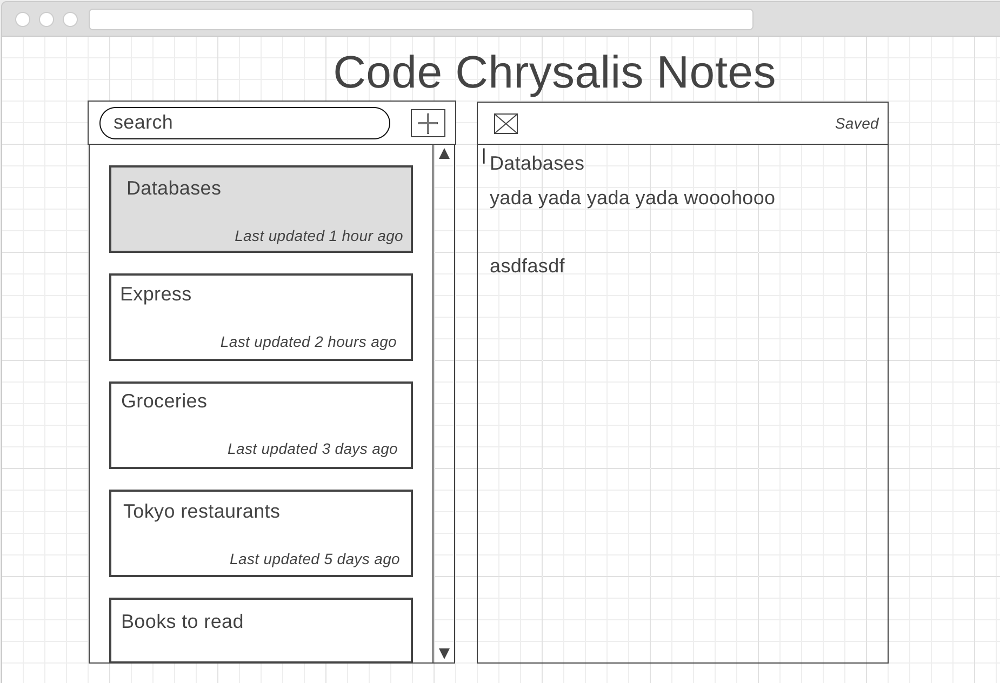

# Halfway Review Part 2

This is part 2 of our halfway review; a pull request must be made before the deadline today to submit.
You will be making a generic full-stack note-taking app. If you are finished early try to add more features and make this app even more impressive!

<!-- toc -->

- [Rules](#rules)
- [Pull Requests](#pull-requests)
- [Requirements ~~ Very Important! ~~](#requirements--very-important-)
  - [Getting Started](#getting-started)
  - [Front-End](#front-end)
    - [Front-End Basic User Requirements](#front-end-basic-user-requirements)
    - [Front-End Advanced Requirements](#front-end-advanced-requirements)
  - [Server-side](#server-side)
    - [Server-side Basic Requirements](#server-side-basic-requirements)
    - [Server-side Advanced Requirements](#server-side-advanced-requirements)
  - [Database](#database)
    - [Database Basic Requirements](#database-basic-requirements)
    - [Database Advanced Requirements](#database-advanced-requirements)
  - [Deployment](#deployment)
    - [Deployment Basic Requirements](#deployment-basic-requirements)
- [What We Look For](#what-we-look-for)

<!-- tocstop -->

## Rules

1.  **You are allowed to use Google.** But:
    - Stay within reason
    - You are not allowed to copy/paste code
1. The use of ChatGPT, CoPilot, or any other AI code generation tools is prohibited.
1.  Feel free to look at official resources/old code, but note that the purpose of this review is to see how much you’re able to do in a limited amount of time, and decide how you want to organize your time during the rest of the course accordingly. Blindly copying and pasting code, even your own, is strongly discouraged and would defeat the purpose of this review.
1.  Tests are **optional**, but highly encouraged.
1.  Remember to give yourself a score for each part of this assessment.

## Pull Requests

When making a pull request, follow the questions in `pull_request_template.md`

In your pull request details, please add in the URL to your deployed app.

## Requirements ~~ Very Important! ~~

Read through and understand the instructions before starting work. **If anything is unclear, flag down an instructor immediately.**

You will be making a full-stack web app that is deployed via Render. Your stack should include:
- React
- Node/Express
- Knex
- Postgres
- Render

You will be making a full-stack note-taking app that looks like the below:

### Getting Started

You may notice that while some of the setup has been done for you, specifically on the back-end, there is still much left to do.

The file placement and setup of Knex has been done for you, however, you may need to make minor adjustments depending upon your operating system and file structure. Please note: none of the files/folders that currently exist should need to be moved or renamed.

On the front-end, nothing has been done for you, except the creation of the client folder. You will need to set up your React app from scratch.

#### A few final tips:
- The .env.example file will need to be renamed to be utilized properly.
- The package.json file(s) are not in the root of project, be sure you CD into the correct folder before running any commands.
- The scripts in the package.json files only partially set up for you, you will need to complete them as well.

### Front-End

Your front-end does not need to look exactly like the above, but you should make a good effort.

#### Front-End Basic User Requirements

Below are expected user behaviors. You may not get time to implement everything to the last detail, but we want to see the basic actions: Create, Read, Update, and Delete.

- READ: Users should be able to see a list of Note Cards on the left-hand side and a single input text box on the right (the Notetaking Space) with the text of the currently chosen Note.
  - The list of Note Cards should be sorted based on time (see wireframe).
  - Each Note Card should have the title of the Note that it is representing and when it was last updated 
  - The title of the Note should come from the first line of the Notetaking Space. If the first line is too long, only take the first 25 characters of that line (see wireframe).
  - Clicking on a Note Card should render the text of the chosen Note in the Notetaking Space and the chosen Note Card (see wireframe)
    
- CREATE: Users should be able to click on an "Add" button that should create a blank Note Card on the left and a blank Notetaking Space on the right.
  - As the first line in the Notetaking Space is written, the corresponding Note Card on the left should update. 
- DELETE: Users should be able to click on a "Delete" button above the Notetaking Space.
  - Clicking the Delete button should remove the note from the list.
  - The current view of the Notetaking Space should default to the next available Note.
- UPDATE: Users should be able to write in the Notetaking Space.
  - When a User updates the first line of a Note in the Notetaking Space, the title of the Note Card on the left should also be updated.
  - The Note should auto-save--a "Saved" text should appear above the Notetaking Space every five seconds after there is no keyboard movement OR when switching to another Note.
      

#### Front-End Advanced Requirements

- Create a search bar that will show the results of the search on the left hand side as a list of Note Cards

### Server-side

#### Server-side Basic Requirements

- You need to have a server that provides an API for your front-end. Your endpoints should be RESTful.
- You should have functionality for all of the CRUD operations specified:
  - Create a note
  - List all notes
  - Read one note
  - Update a note
  - Delete a note

#### Server-side Advanced Requirements

- Add in a search functionality

### Database

#### Database Basic Requirements

1.  The project must use postgresql for your database.
1.  Create seed files for your database and a script to populate your DB with Data.
1.  Create migrations for your database.
1.  Connect it with your server!
1.  Put a 'migrate' script in your `package.json`

#### Database Advanced Requirements

- Add in search capabilities in your database!

### Deployment

#### Deployment Basic Requirements

1.  Deploy your app and database using Render.
1.  **Please provide a link to your deployed app in your pull request.**

## What We Look For

The most important thing that we will be looking for is: **DOES IT HAVE THE FULL-STACK FUNCTIONALITY WE WANT?** In other words, we want you to be able to come up with an MVP. Remember to spend your time wisely.

Your understanding of the material will be rated through:

- if your code works
- the quality of your code
- code style and organization
- the quality of your commits
